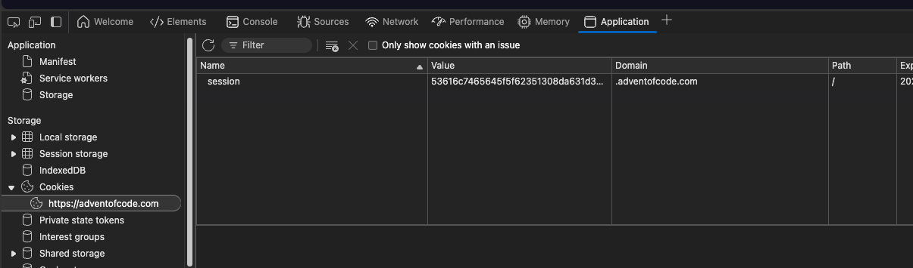

# aoc-rust

## Overview

This repository contains my solutions to Advent of Code challenges, implemented in Rust. Advent of Code can be found from: [adventofcode.com](https://adventofcode.com/).

## Available solutions

### 2024

| Day | Problem                                                   | Solution                         |
| --- | --------------------------------------------------------- | -------------------------------- |
| 1   | [Historian Hysteria](https://adventofcode.com/2024/day/1) | [Source](src/year_2024/day_1.rs) |
| 1   | [Red-Nosed Reports](https://adventofcode.com/2024/day/2)  | [Source](src/year_2024/day_2.rs) |

### 2022

| Day | Problem                                                        | Solution                         |
| --- | -------------------------------------------------------------- | -------------------------------- |
| 1   | [Calorie Counting](https://adventofcode.com/2022/day/1)        | [Source](src/year_2022/day_1.rs) |
| 2   | [Rock Paper Scissors](https://adventofcode.com/2022/day/2)     | [Source](src/year_2022/day_2.rs) |
| 3   | [Rucksack Reorganization](https://adventofcode.com/2022/day/3) | [Source](src/year_2022/day_3.rs) |

## Prerequisites

Make sure you have `Rust` and `Cargo` installed, see: [rust-lang.org](https://www.rust-lang.org/tools/install).

Before running the program, copy the `.env.example` file to project root, rename it to `.env` and fill in your Advent of Code session token. You can find it by logging in to [adventofcode.com](https://adventofcode.com/) and copying the value of the session cookie. Your unique session cookie can be found using your browser's dev tools:



## Usage

Either run or build the program with `Cargo`. Each solution should simply print out an answer to both parts. See the examples below.

### Examples

**Run:**

```sh
cargo run -- --day 1 --year 2022
```

**Build:**

1. Build with release configuration:

```sh
cargo build --release
```

2. Produced binary can be found from `src/target/release` and ran with the following command:

```sh
./aoc-rust --day 1 --year 2022
```
